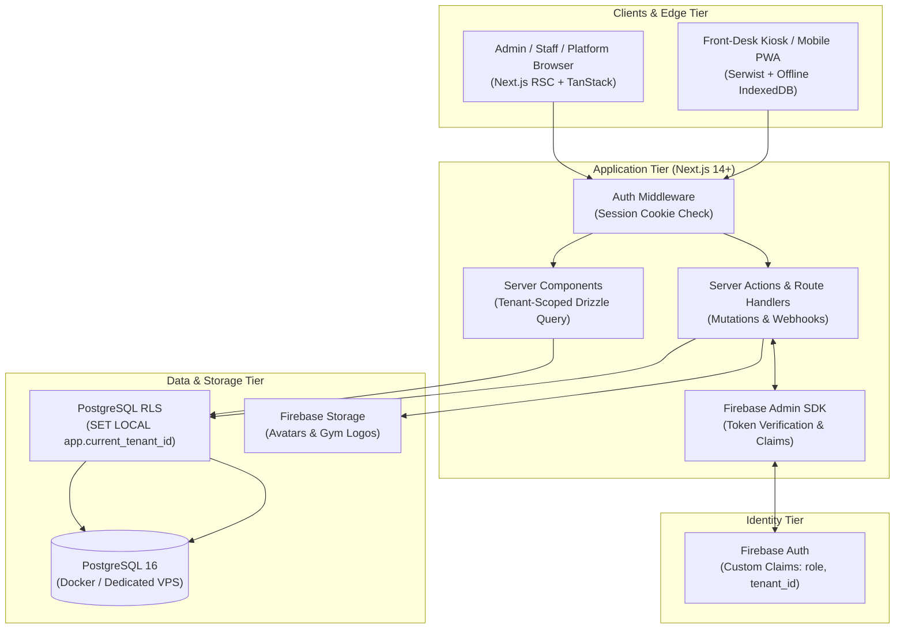

# GymERP — Multi-Tenant Gym Management Platform

> High-performance, multi-tenant ERP platform designed for independent gyms, martial arts dojos, and fitness studios. Built with strict data isolation, offline-ready check-in kiosks, and role-scoped operational dashboards.

[](https://nextjs.org/)
[](https://www.postgresql.org/)
[](https://orm.drizzle.team/)
[](https://firebase.google.com/)
[](https://tailwindcss.com/)
[](https://ui.shadcn.com/)

---

## System Architecture



---

## 4-Tier Security & Role Hierarchy

Multi-tenancy is enforced with **defense-in-depth**:
1. **Application Layer**: All Drizzle ORM queries are wrapped in tenant repository scopes (`where: eq(table.tenantId, tenantId)`).
2. **Database Layer (RLS)**: PostgreSQL Row-Level Security policies evaluate `tenant_id = current_setting('app.current_tenant_id', true)::uuid`.
3. **Identity Layer**: Firebase Auth JWT custom claims strictly isolate user roles.

| Role | Scope | Database Access | Key Capabilities |
|---|---|---|---|
| **Platform Superadmin** (`platform`) | Global | `tenants` table **only**. Zero RLS grant to tenant data. | Provision gyms, toggle tenant lifecycle (`trial`, `active`, `suspended`), inspect system ARR and DB metrics. Cannot inspect members, payments, or attendance. |
| **Gym Admin** (`admin`) | Single Tenant | Full CRUD within assigned `tenant_id`. | Configure membership plans, manage staff accounts, view financial metrics, export rosters. |
| **Front-Desk Staff** (`staff`) | Single Tenant | Read/write members, check-ins, manual payments. No plan/pricing edits. | Search members, register new attendees, operate self-service QR check-in kiosk with camera scanner. |
| **Gym Member** (End User) | Unauthenticated MVP | Member records in DB with unique `qr_token`. (Portal planned for post-MVP). | Check in via physical barcode/QR token at desk or kiosk scanner. |

---

## Repository Structure

```
gymerp/
├── docker-compose.yml              # Local PostgreSQL 16 container with healthcheck
├── .env.example                    # Environment variable template
├── SETUP.md                        # Developer 5-minute quickstart guide
├── README.md                       # Project architecture and reference manual
│
├── docs/                           # Architecture, specs, and design system
│   ├── PRD.md                      # Product Requirements Document
│   ├── tech-stack.md               # Technical choices & migration principles
│   ├── setup-guide.md              # Exhaustive setup & runbook guide
│   ├── design-system.md            # Visual language, tokens, and dark aesthetic
│   │
│   ├── phase-0-foundation-schema.md       # Drizzle Schema + Postgres RLS + Firebase Setup
│   ├── phase-1-web-auth-dashboard-shell.md# Session cookies, route guards, UI layout
│   ├── phase-2-platform-tenant-management.md # Superadmin portal & tenant lifecycle
│   ├── phase-3-web-members-memberships.md # Member directory, plans, and profiles
│   ├── phase-4-web-payments-attendance.md # Razorpay webhooks, kiosk, offline sync
│   ├── phase-5-pwa-performance-hardening.md # Serwist PWA, security audits, prod checklist
│   │
│   ├── wireframes/                 # ASCII UI wireframes for all views
│   └── demo/                       # Interactive HTML/JS/CSS prototypes
│       ├── index.html              # Demo Hub & quick role launcher
│       ├── 01-login.html           # Auth portal & credentials switcher
│       ├── 02-platform.html        # Platform Superadmin multi-tenant console
│       ├── 03-admin.html           # Gym Admin operational dashboard
│       └── 04-staff.html           # Staff terminal & laser-scan kiosk
│
├── src/ (Target implementation)
│   ├── app/                        # Next.js 14 App Router routes
│   │   ├── (auth)/                 # Login and password recovery
│   │   ├── (platform)/             # Platform superadmin routes
│   │   ├── (admin)/                # Gym admin dashboard routes
│   │   ├── (staff)/                # Front-desk and kiosk routes
│   │   └── api/                    # Auth session exchange & webhooks
│   ├── components/                 # shadcn/ui and custom design system primitives
│   ├── lib/
│   │   ├── api/                    # Modular business logic services
│   │   ├── db/                     # Drizzle schema, client, and tenant wrapper
│   │   └── firebase/               # Firebase Client & Admin SDK singletons
│   └── types/                      # Shared TypeScript models and claims
```

---

## Quick Navigation

- **Fast Onboarding**: Follow [SETUP.md](file:///home/rev/Documents/projects/gymerp/SETUP.md) for 5-minute setup.
- **Deep Setup Manual**: Read [docs/setup-guide.md](file:///home/rev/Documents/projects/gymerp/docs/setup-guide.md).
- **Interactive Demos**: Launch [`docs/demo/index.html`](file:///home/rev/Documents/projects/gymerp/docs/demo/index.html) in your browser.
- **Implementation Specs**:
  - [Phase 0 — Database Schema, RLS & Firebase Auth](file:///home/rev/Documents/projects/gymerp/docs/phase-0-foundation-schema.md)
  - [Phase 1 — Auth Flow, Session Cookies & Shell](file:///home/rev/Documents/projects/gymerp/docs/phase-1-web-auth-dashboard-shell.md)
  - [Phase 2 — Platform Superadmin & Tenant Management](file:///home/rev/Documents/projects/gymerp/docs/phase-2-platform-tenant-management.md)
  - [Phase 3 — Members & Memberships](file:///home/rev/Documents/projects/gymerp/docs/phase-3-web-members-memberships.md)
  - [Phase 4 — Payments, Webhooks & Attendance Kiosk](file:///home/rev/Documents/projects/gymerp/docs/phase-4-web-payments-attendance.md)
  - [Phase 5 — PWA, Performance & Production Hardening](file:///home/rev/Documents/projects/gymerp/docs/phase-5-pwa-performance-hardening.md)

---

## License
Proprietary & Confidential. All rights reserved.
