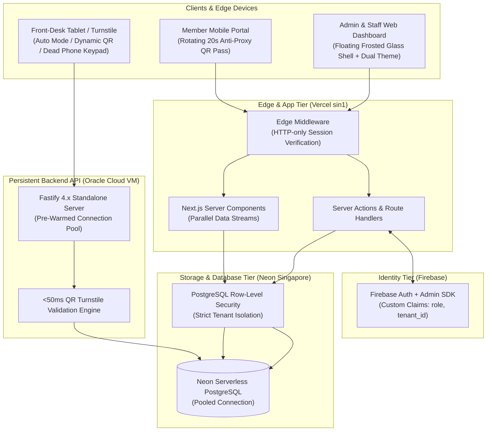

# GymERP — Multi-Tenant Gym Management Platform

> High-performance, multi-tenant ERP platform designed for independent gyms, martial arts dojos, and fitness studios. Built with strict data isolation, sub-50ms turnstile verification, dynamic anti-proxy QR check-in, and dual light/dark frosted glass interfaces.

[](https://nextjs.org/)
[](https://fastify.dev/)
[](https://neon.tech/)
[](https://orm.drizzle.team/)
[](https://firebase.google.com/)
[](https://tailwindcss.com/)
[](https://ui.shadcn.com/)

---

## Live Deployments

- **Web Application**: [`https://gymerp-liard.vercel.app`](https://gymerp-liard.vercel.app)
- **Fastify Backend API**: [`https://gymerp.duckdns.org`](https://gymerp.duckdns.org)
- **API Health Telemetry**: [`https://gymerp.duckdns.org/health`](https://gymerp.duckdns.org/health)

---

## System Architecture



---

## 4-Tier Security & Role Hierarchy

Multi-tenancy is enforced with **defense-in-depth**:
1. **Application Layer**: All Drizzle ORM queries are scoped with `where: eq(table.tenantId, tenantId)`.
2. **Database Layer (RLS)**: PostgreSQL Row-Level Security policies evaluate `tenant_id = current_setting('app.current_tenant_id', true)::uuid`.
3. **Identity Layer**: Firebase Auth JWT custom claims cryptographically restrict access boundaries.

| Role | Scope | Database Access | Key Capabilities |
| :--- | :--- | :--- | :--- |
| **Platform Superadmin** (`platform`) | Global Fleet | `tenants` table only. Zero access to member PII. | Provision gyms, toggle tenant lifecycle (`trial`, `active`, `suspended`), license extension dialog (+30d, +90d, +1yr, lifetime), admin password reset. |
| **Gym Admin** (`admin`) | Single Tenant | Full CRUD within assigned `tenant_id`. | Configure membership plans, manage staff accounts, inspect financial KPIs and attendance trends, schedule group classes. |
| **Front-Desk Staff** (`staff`) | Single Tenant | Read/write members, check-ins, manual payments. | Search members, register walk-in signups, operate self-service QR check-in kiosk terminal with automatic check-in/out resolution. |
| **Gym Member** (`member`) | Personal Account | Member's own profile, bookings, and passes. | Launch dynamic smartphone entry pass, book group classes, view workout history and streak records. |

---

## Key Features

- **Dynamic Anti-Proxy QR Pass**: 20-second rotating cryptographic nonces prevent members from screenshotting passes to sneak unregistered friends in.
- **Dead-Phone Keypad Backup**: Touchscreen numeric pad on front-desk kiosk allows members whose phone battery died to enter their phone number for instant photo and status verification.
- **Sub-50ms Turnstile Validation**: Persistent Fastify backend with warm PostgreSQL connection pooling handles peak morning and evening rushes without latency.
- **Floating Frosted Glass UI**: Clean, modern interface inspired by high-end floating aesthetics (`leprint`), featuring dual light and dark theme support via `next-themes` and `shadcn/ui`.
- **Hidden Superadmin Backdoor**: Platform console is concealed from public navigation and accessible via `Ctrl+Shift+P` (`Cmd+Shift+P`) or 5 clicks on the footer "G" logo.

---

## Repository Structure

```
gymerp/
├── docs/                           # Architecture, specifications, and runbooks
│   ├── README.md                   # Documentation directory index
│   ├── CONTEXT.md                  # Comprehensive architectural truth engine & route matrix
│   ├── setup.md                    # 5-minute local developer quickstart & env guide
│   ├── deployment.md               # Production deployment runbook (Vercel, VM, Neon)
│   ├── api-server-guide.md         # Dedicated Fastify API documentation & benchmarks
│   ├── design-system.md            # UI design system tokens & frosted glass mechanics
│   ├── tech-stack.md               # Technology choices, versions & isolation rules
│   ├── PRD.md                      # Product Requirements Document
│   ├── CLAUDE.md                   # AI agent & developer guidelines
│   ├── phases/                     # Historical milestone planning specs (Phases 0-5)
│   ├── demo/                       # Interactive HTML/JS/CSS prototypes
│   └── wireframes/                 # ASCII UI wireframes
│
├── src/
│   ├── app/                        # Next.js 14 App Router
│   │   ├── (auth)/                 # Admin, staff, and member login flows
│   │   ├── (platform)/             # Platform superadmin console (`/platform`)
│   │   ├── (admin)/                # Gym admin dashboard & analytics (`/admin`)
│   │   ├── (staff)/                # Front-desk and kiosk routes (`/staff`)
│   │   ├── (portal)/               # Member athlete mobile portal (`/portal`)
│   │   └── api/                    # Auth session exchange & webhooks
│   ├── components/                 # shadcn/ui and custom design system primitives
│   │   ├── navigation/             # Floating frosted glass navbar and collapsible sidebar
│   │   ├── kiosk/                  # Turnstile display, camera scanner, keypad backup
│   │   ├── landing/                # Modern dual-mode public landing page
│   │   └── ui/                     # Accessible shadcn/ui components
│   ├── lib/
│   │   ├── api/                    # Modular business logic services
│   │   ├── db/                     # Drizzle schema, client, and tenant wrapper
│   │   └── firebase/               # Firebase Client & Admin SDK singletons
│   ├── server/                     # Persistent Fastify 4.x backend API (`index.ts`)
│   └── types/                      # Shared TypeScript models and claims
│
├── tailwind.config.ts              # Tailwind CSS 3.4 configuration with CSS variables
└── tsconfig.json                   # TypeScript compiler configuration
```

---

## 5-Minute Developer Quickstart

### 1. Clone & Install Dependencies
```bash
git clone https://github.com/revanthlol/gymerp.git
cd gymerp
pnpm install
```

### 2. Configure Environment Variables
```bash
cp .env.example .env.local
```
Configure your Neon database URL and Firebase credentials in `.env.local`.

### 3. Push Database Schema & Seed Data
```bash
pnpm db:push
pnpm db:seed
```

### 4. Start Development Services
```bash
pnpm dev
```
- Frontend: [http://localhost:3000](http://localhost:3000)
- Fastify API: [http://localhost:4000/health](http://localhost:4000/health)

---

## Detailed Documentation

For exhaustive technical guides, refer to the [`docs/`](./docs/) directory:
- 📖 [Documentation Index](./docs/README.md)
- 🚀 [Developer Setup Guide](./docs/setup.md)
- 🚢 [Production Deployment Runbook](./docs/deployment.md)
- ⚡ [Fastify API Server Manual](./docs/api-server-guide.md)
- 🎨 [UI Design System & Tokens](./docs/design-system.md)
- 🏛️ [Architectural Truth Engine (CONTEXT.md)](./docs/CONTEXT.md)

---

## License
Proprietary & Confidential. All rights reserved.
