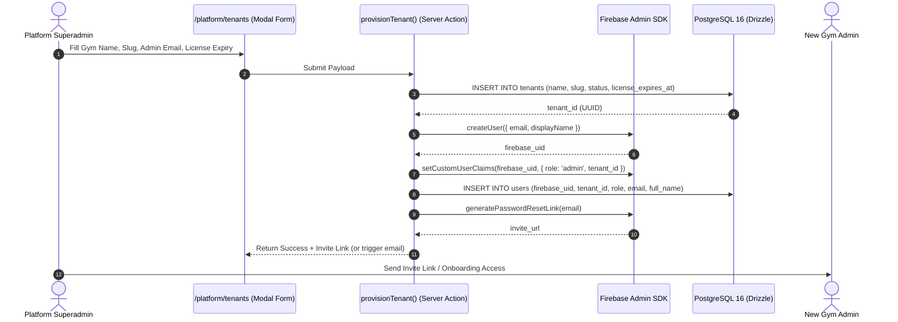

# Phase 2 — Platform Superadmin & Tenant Lifecycle Management

> **Scope:**
> Deliver the global management portal for the Platform Superadmin: multi-tenant provisioning, automated Firebase Admin credential initialization, tenant lifecycle states (`trial`, `active`, `suspended`), license tracking, and real-time lockout enforcement across all downstream gym portals.

---

## 1. Architectural Workflow



---

## 2. Tenant Provisioning Specification

### 2.1 Zod Validation Schema (`src/lib/validations/tenant.ts`)
```typescript
import { z } from "zod";

export const createTenantSchema = z.object({
  name: z.string().min(2, "Gym name must be at least 2 characters").max(80),
  slug: z.string()
    .min(2)
    .max(50)
    .regex(/^[a-z0-9-]+$/, "Slug must be lowercase alphanumeric with hyphens"),
  contactEmail: z.string().email("Invalid email address"),
  phone: z.string().min(7).max(20),
  adminFullName: z.string().min(2, "Admin full name is required"),
  initialStatus: z.enum(["trial", "active"]).default("active"),
  licenseDurationDays: z.number().int().positive().default(365),
});

export type CreateTenantInput = z.infer<typeof createTenantSchema>;
```

### 2.2 Server Action Implementation (`src/lib/api/tenants.ts`)
```typescript
"use server";

import { adminAuth } from "@/lib/firebase/admin";
import { db } from "@/lib/db";
import { tenants, users } from "@/lib/db/schema";
import { createTenantSchema, CreateTenantInput } from "@/lib/validations/tenant";
import { withTenantDb } from "@/lib/db/tenant";
import { revalidatePath } from "next/cache";

export async function provisionTenantAction(rawInput: CreateTenantInput) {
  const input = createTenantSchema.parse(rawInput);

  // 1. Calculate License Expiry
  const licenseExpiresAt = new Date();
  licenseExpiresAt.setDate(licenseExpiresAt.getDate() + input.licenseDurationDays);

  return await withTenantDb({ userId: "platform-actor", role: "platform", tenantId: null }, async (tx) => {
    // 2. Insert Tenant Record
    const [newTenant] = await tx.insert(tenants).values({
      name: input.name,
      slug: input.slug,
      status: input.initialStatus,
      contactEmail: input.contactEmail,
      phone: input.phone,
      licenseExpiresAt,
    }).returning();

    // 3. Create Firebase User with Temporary Setup Key
    const tempPassword = `GymInit_${Math.random().toString(36).slice(-8)}!`;
    const fbUser = await adminAuth.createUser({
      email: input.contactEmail,
      displayName: input.adminFullName,
      password: tempPassword,
    });

    // 4. Set Custom User Claims for Tenant Admin
    await adminAuth.setCustomUserClaims(fbUser.uid, {
      role: "admin",
      tenant_id: newTenant.id,
    });

    // 5. Insert User into PostgreSQL
    await tx.insert(users).values({
      firebaseUid: fbUser.uid,
      tenantId: newTenant.id,
      role: "admin",
      email: input.contactEmail,
      fullName: input.adminFullName,
    });

    // 6. Generate Password Reset / Invitation Link
    const inviteLink = await adminAuth.generatePasswordResetLink(input.contactEmail);

    revalidatePath("/platform");

    return {
      success: true,
      tenantId: newTenant.id,
      inviteLink,
    };
  });
}
```

---

## 3. Tenant Lifecycle & Suspension Lockout

When a gym fails to renew its license or violates terms, the Platform Superadmin toggles its status to `suspended`.

### 3.1 Suspension Server Action
```typescript
"use server";

import { db } from "@/lib/db";
import { tenants, users } from "@/lib/db/schema";
import { eq } from "drizzle-orm";
import { adminAuth } from "@/lib/firebase/admin";
import { withTenantDb } from "@/lib/db/tenant";
import { revalidatePath } from "next/cache";

export async function toggleTenantStatusAction(
  tenantId: string,
  newStatus: "active" | "suspended" | "trial"
) {
  await withTenantDb({ userId: "platform-actor", role: "platform", tenantId: null }, async (tx) => {
    // Update tenant status in database
    await tx.update(tenants)
      .set({ status: newStatus, updatedAt: new Date() })
      .where(eq(tenants.id, tenantId));

    // If suspended, revoke all active sessions across this gym's staff and admin
    if (newStatus === "suspended") {
      const tenantUsers = await tx.select({ firebaseUid: users.firebaseUid })
        .from(users)
        .where(eq(users.tenantId, tenantId));

      await Promise.all(
        tenantUsers.map((u) => adminAuth.revokeRefreshTokens(u.firebaseUid).catch(() => null))
      );
    }
  });

  revalidatePath("/platform");
  return { success: true };
}
```

### 3.2 Tenant Status Guard (`src/app/(admin)/layout.tsx` & `src/app/(staff)/layout.tsx`)
In the root layout of both the admin and staff route groups:
```typescript
import { getSession } from "@/lib/auth/session";
import { db } from "@/lib/db";
import { tenants } from "@/lib/db/schema";
import { eq } from "drizzle-orm";
import { redirect } from "next/navigation";
import { SuspendedLockoutView } from "@/components/shared/suspended-lockout";

export default async function TenantLayout({ children }: { children: React.ReactNode }) {
  const session = await getSession();
  if (!session || !session.tenantId) redirect("/login");

  // Fetch current tenant status directly
  const [tenant] = await db.select({
    status: tenants.status,
    name: tenants.name,
    expiresAt: tenants.licenseExpiresAt,
  })
  .from(tenants)
  .where(eq(tenants.id, session.tenantId))
  .limit(1);

  if (!tenant || tenant.status === "suspended") {
    return <SuspendedLockoutView gymName={tenant?.name ?? "Gym"} />;
  }

  return <>{children}</>;
}
```

---

## 4. UI Components & Platform Dashboard Views

1. **KPI Metric Strip**:
   - **Active Gyms**: Total active vs trial vs suspended tenants.
   - **Global ARR / License Value**: Calculated from active license terms.
   - **System Database Status**: Live PostgreSQL ping latency.
2. **Tenant Master Table**:
   - Search by gym name or slug.
   - Filter by status (`All`, `Active`, `Trial`, `Suspended`).
   - Action triggers: "Manage", "Extend License", "Toggle Suspension".
3. **Slide-Over Detail Drawer**:
   - Displays primary admin email, creation date, license expiration date.
   - Direct link to regenerate invite or copy login URL.

---

## 5. Phase 2 Exit Criteria

- [ ] Platform Superadmin can log in and land on `/platform`.
- [ ] Submitting the "New Gym" modal creates the `tenants` record and creates the Firebase Admin user with custom claims (`role: 'admin'`, `tenant_id: <uuid>`).
- [ ] Generated password reset/invite link successfully allows the gym admin to set their password and log in.
- [ ] Marking a tenant as `suspended` immediately revokes sessions and renders the `<SuspendedLockoutView>` when the admin or staff attempts to access `/admin` or `/staff`.
- [ ] Reactivating the tenant instantly restores access.
