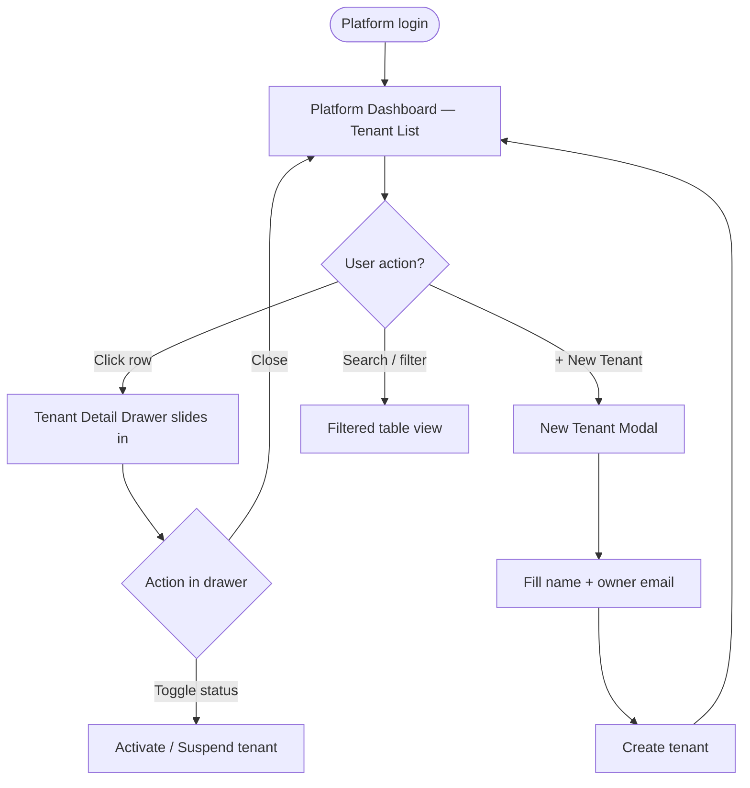

# Wireframe: Platform Portal

> **Route:** `/platform`  
> **Role:** Platform (Rev's team only)  
> **Scope:** Tenant management only — zero access to member-level data

---

## User Flow



---

## Shell Layout

```
┌─────────────────────────────────────────────────────────────┐
│ Sidebar (240px)          │  Main Content Area               │
│                          │                                  │
│  ⊞ GymERP [Platform]    │  ┌──────────────────────────┐    │
│  ─────────────────       │  │  Page Header             │    │
│  ⊞ Tenants        ←active│  │  Tenants    [+ New Tenant]│    │
│  ⊞ Settings              │  └──────────────────────────┘    │
│  ─────────────────       │                                  │
│  [avatar] Platform Admin │  [🔍 Search tenants]  [Status ▾] │
│  ● ● ● ●  ← theme dots   │                                  │
└─────────────────────────────────────────────────────────────┘
```

---

## Screen 1: Tenant List

```
┌──────────────────────────────────────────────────────────────┐
│  Tenants                                    [+ New Tenant]   │
│                                                              │
│  [🔍 Search tenants...]        [Status: All ▾]              │
│                                                              │
│  ┌──────────────────────────────────────────────────────┐    │
│  │ GYM NAME       │ STATUS     │ MEMBERS │ PLAN  │ SINCE │   │
│  │────────────────┼────────────┼─────────┼───────┼───────│   │
│  │ FitZone Gym    │ ● Active   │ 142     │ Pro   │Jan 25 │   │
│  │ PowerHouse Pro │ ● Trial    │ 0       │ Trial │Aug 26 │   │
│  │ Iron Will Club │ ○ Suspended│ 89      │ Basic │Mar 24 │   │
│  │ Peak Perform.  │ ● Active   │ 231     │ Pro   │Jun 24 │   │
│  │ Body Works     │ ● Active   │ 57      │ Basic │Nov 24 │   │
│  │────────────────────────────────────────────────────── │   │
│  │  ← 1  2  3 →   Showing 1–10 of 24 tenants            │   │
│  └──────────────────────────────────────────────────────┘    │
└──────────────────────────────────────────────────────────────┘
```

**Table columns:**
| Column | Type | Sortable |
|---|---|---|
| Gym Name | Text | Yes |
| Status | Badge (Active/Trial/Suspended) | Yes (filter) |
| Members | Number | Yes |
| Plan | Text badge | No |
| Since | Date | Yes |

---

## Screen 2: Tenant Detail Drawer (slide-in right)

```
                              ┌──────────────────────────────┐
                              │  ✕  Tenant Detail            │
                              │  ─────────────────────────── │
                              │                              │
                              │  FitZone Gym                 │
                              │  ID: tenant_abc123           │
                              │  Owner: owner@fitzzone.com   │
                              │                              │
                              │  Status                      │
                              │  ┌──────────────────────┐   │
                              │  │  ● Active             │   │
                              │  └──────────────────────┘   │
                              │                              │
                              │  Members:    142             │
                              │  Plan:       Pro             │
                              │  Since:      Jan 2025        │
                              │  Last login: 2h ago          │
                              │                              │
                              │  ─────────────────────────── │
                              │                              │
                              │  [Suspend Tenant]  ← danger  │
                              │  [Activate Tenant] ← accent  │
                              │                              │
                              └──────────────────────────────┘
```

**Drawer behavior:**
- Opens on row click, slides in from right (`250ms cubic-bezier(0.32, 0.72, 0, 1)`)
- Overlay dims main content (`bg-black/40`)
- Clicking overlay or ✕ closes
- Status toggle shows confirmation dialog before submit

---

## Screen 3: New Tenant Modal

```
         ┌────────────────────────────────────┐
         │  Create New Tenant                 │
         │  ─────────────────────────────     │
         │                                    │
         │  Gym Name                          │
         │  ┌──────────────────────────────┐  │
         │  │ e.g. FitZone Gym             │  │
         │  └──────────────────────────────┘  │
         │                                    │
         │  Owner Email                       │
         │  ┌──────────────────────────────┐  │
         │  │ owner@theirgym.com           │  │
         │  └──────────────────────────────┘  │
         │                                    │
         │  Plan                              │
         │  ┌──────────────────────────────┐  │
         │  │ Trial          ▾             │  │
         │  └──────────────────────────────┘  │
         │                                    │
         │  [Cancel]     [Create Tenant →]    │
         └────────────────────────────────────┘
```

---

## Component Notes

| Element | Spec |
|---|---|
| **Sidebar** | `bg-surface`, collapsed to 56px icon-only on `md` breakpoint |
| **Status badge** | `● Active` → accent dot + accent-subtle bg; `Suspended` → red; `Trial` → yellow |
| **Table** | `h-10` rows, hover `bg-muted/60 100ms`, column headers `text-label uppercase tracking-wider text-muted` |
| **Drawer** | `w-96`, `bg-elevated`, `border-l border-strong`, slide-in animation |
| **Suspend button** | `bg-red-900/30 border-red-800 text-red-400` (destructive variant) |
