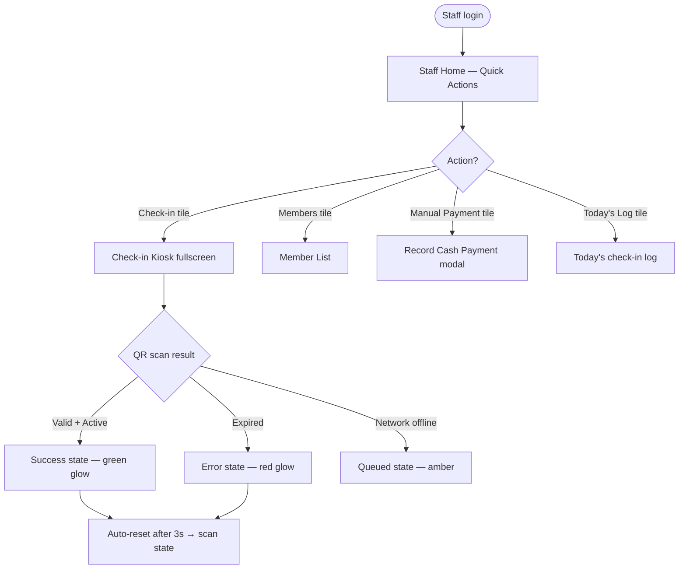
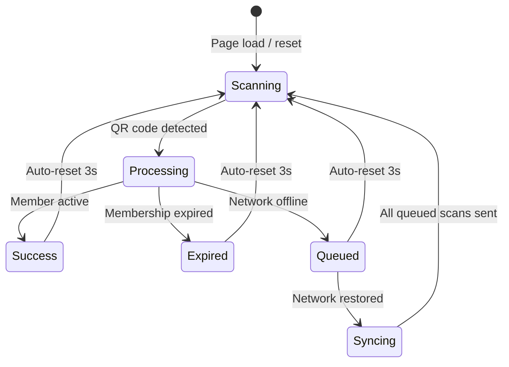

# Wireframe: Staff Portal

> **Route:** `/staff`  
> **Role:** Staff (Front-desk / gym employees)  
> **Scope:** Member CRUD, check-in scanning, manual cash payments — no pricing edits

---

## User Flow



---

## Screen 1: Staff Home (`/staff`)

```
┌───────────────────────────────────────────────────────────┐
│ Sidebar (240px)        │  Staff Home                      │
│                        │                                  │
│  ⊞  FitZone Gym        │  Good morning, Rahul             │
│  ─────────────────     │  Staff · Front Desk              │
│  ⊞  Check-in ← active  │                                  │
│  ⊞  Members            │  ┌─────────────┐ ┌────────────┐  │
│  ⊞  Payments           │  │  ⊞          │ │  ⊞        │  │
│  ⊞  Today's Log        │  │  Check-In   │ │  Members  │  │
│  ─────────────────     │  │  Kiosk      │ │  List     │  │
│  [avatar] Rahul(Staff) │  └─────────────┘ └────────────┘  │
│  ● ● ● ●               │                                  │
│                        │  ┌─────────────┐ ┌────────────┐  │
│                        │  │  ⊞          │ │  ⊞        │  │
│                        │  │  Manual     │ │  Today's  │  │
│                        │  │  Payment    │ │  Log      │  │
│                        │  └─────────────┘ └────────────┘  │
│                        │                                  │
│                        │  ─────────────────────────────   │
│                        │  Recent Check-ins Today          │
│                        │  ✓ Ravi Kumar       10:23am      │
│                        │  ✓ Priya Mehta      10:18am      │
│                        │  ✓ Arjun Singh      10:05am      │
│                        │  [View full log →]               │
└───────────────────────────────────────────────────────────┘
```

**Quick action tiles:**
- `bg-surface` card, `p-6`, large icon centered (`text-accent`, `w-10 h-10`)
- Label: `text-title`
- Hover: accent glow + bg shift

---

## Screen 2: Check-In Kiosk (`/staff/checkin`) — PWA Fullscreen

```
┌───────────────────────────────────────────────────────────────┐
│                                                               │
│  ⊞ GymERP          FitZone Gym             [← Exit Kiosk]    │
│  ─────────────────────────────────────────────────────────── │
│                                                               │
│  [OFFLINE BANNER — amber — only when offline]                 │
│  ⚠  Offline — scans are being queued locally                 │
│                                                               │
│  ─────────────────────────────────────────────────────────── │
│                                                               │
│              ┌────────────────────────────┐                   │
│              │                            │                   │
│              │  ┌──┐            ┌──┐      │                   │
│              │  └──┘            └──┘      │                   │
│              │                            │                   │
│              │       CAMERA FEED          │                   │
│              │      [QR scan area]        │                   │
│              │                            │                   │
│              │  ┌──┐            ┌──┐      │                   │
│              │  └──┘            └──┘      │                   │
│              └────────────────────────────┘                   │
│              corner brackets in accent color                  │
│                                                               │
│                  Scan member QR code                          │
│                  text-secondary, centered                     │
│                                                               │
│  ─────────────────────────────────────────────────────────── │
│                                                               │
│  [SUCCESS STATE — green glow pulse — shown after valid scan]  │
│  ┌──────────────────────────────────────────────────────┐     │
│  │  ✓  Ravi Kumar                                       │     │
│  │     Monthly Plan  ·  Expires Sep 30, 2026            │     │
│  │     ● Active                                         │     │
│  └──────────────────────────────────────────────────────┘     │
│                                                               │
│  [ERROR STATE — red glow pulse + shake — expired/invalid]     │
│  ┌──────────────────────────────────────────────────────┐     │
│  │  ✗  Vikram Rao                                       │     │
│  │     Membership EXPIRED — Sep 1, 2026                 │     │
│  │     [Contact Admin to renew]                         │     │
│  └──────────────────────────────────────────────────────┘     │
│                                                               │
│  ─────────────────────────────────────────────────────────── │
│  Today's check-ins: 34           [View Log]                   │
└───────────────────────────────────────────────────────────────┘
```

---

## Check-In State Machine



---

## Kiosk Design Notes

| Element | Spec |
|---|---|
| **Layout** | No sidebar, no standard nav. Full viewport. `display: standalone` PWA mode |
| **Camera area** | `max-w-sm` centered, corner bracket SVGs in `--accent` color |
| **Success card** | `border: 1px solid #22c55e`, `box-shadow: 0 0 24px rgba(34,197,94,0.3)`, pulse animation |
| **Error card** | `border: 1px solid #ef4444`, `box-shadow: 0 0 24px rgba(239,68,68,0.3)`, shake + pulse |
| **Offline banner** | `bg-amber-900/40 border-amber-700 text-amber-400`, slides down from top |
| **Auto-reset** | Success/error state lasts 3s, then fades out back to scan state |
| **Queued indicator** | Amber dot in bottom bar showing queued scan count |

---

## Accessibility & PWA Notes

- Service worker caches: **app shell only** (JS/CSS/fonts/icons)
- Auth state + all API responses: always network-first, **never cached**
- On kiosk exit (logout): `caches.delete()` + clear `localStorage` + `sessionStorage`
- Offline queuing: `IndexedDB` via a queue manager, syncs when online
- QR scanning: `jsQR` or `zxing-js/browser` via `getUserMedia` API
